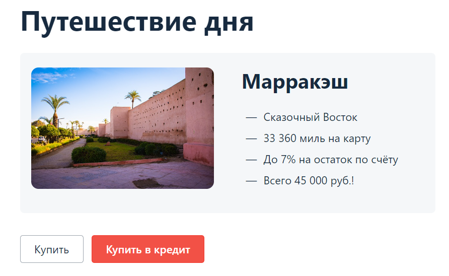

# Сервис для покупки тура

## Бизнес-часть

### Описание приложения

Приложение - это веб-сервис, который предлагает купить тур по определенной цене двумя способами:

1. Обычная оплата по дебетовой карте.
2. Уникальная технология: выдача кредита по данным банковской карты.

Само приложение не обрабатывает данные по картам, а пересылает их банковским сервисам:
* сервису платежей, далее Payment Gate;
* кредитному сервису, далее Credit Gate.

Приложение в собственной СУБД должно сохранять информацию о том, успешно ли был совершен платеж и каким способом.
Данные карт сохранять не допускается.

## Настройка и запуск проекта (SUT)

1. Клонировать репозиторий через терминал командой - git clone git@github.com:IrinaSanna/BuyingTouristTickets.git
2. Открыть проект через IntelliJ IDEA.
3. Запустить Docker desktop (установить при необходимости)
4. В терминале IDEA выполнить команду docker-compose up
5. Во втором терминале выполнить команду по запуску jar-файла (SUT) - java -jar aqa-shop.jar
6. В браузере Google Chrome в адресной строке ввести URL - localhost:8080

## Запуск автотестов и формирование отчета

1. Открыть класс PaymentByCardTest:
* нажать кнопку Run Test;
* либо выполнить команду в терминале ./gradlew test clean --info
2. Для формирования allure-отчета, необходимо в терминале выполнить команду ./gradlew allureserve