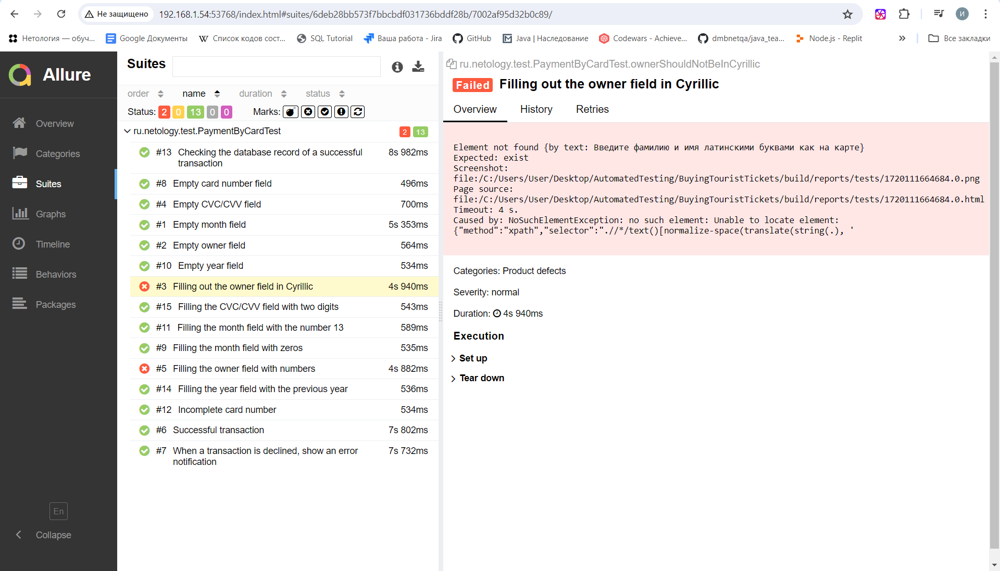

# Отчётные документы по итогам автоматизации

1. В соответствии с планом было написано 15 автотестов.

Результаты тестов по тестируемому функционалу представлены в отчете, с ипользованием allure-отчета:

## Общие рекомендации

Для сокращения время для написания автотестов, необходимо добавить элементам страницы атрибут test-id.